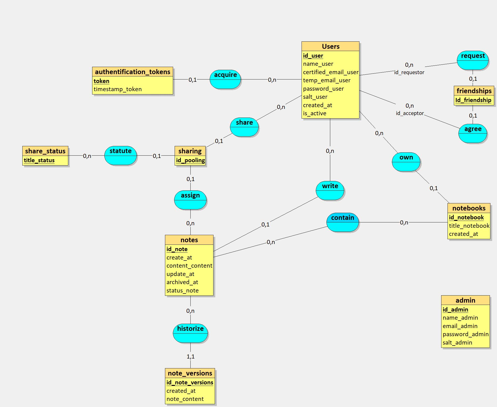

# Modèle Conceptuel des Données (MCD)

## Introduction

Le Modèle Conceptuel des Données est une représentation abstraite des structures de données d'un système d'information. Il identifie les entités, leurs attributs et les relations entre elles, sans se soucier des détails techniques. Le MCD sert de base pour la conception et la communication des exigences métier.

Les principales entités identifiées dans le MCD incluent les utilisateurs, les notes, les carnets, les relations d'amitié, les statuts, et les partages de notes. Le MCD fournit une vue d'ensemble des attributs spécifiques à chaque entité et des relations qui les lient, assurant ainsi une conception cohérente et efficace de la base de données.

## Schéma

