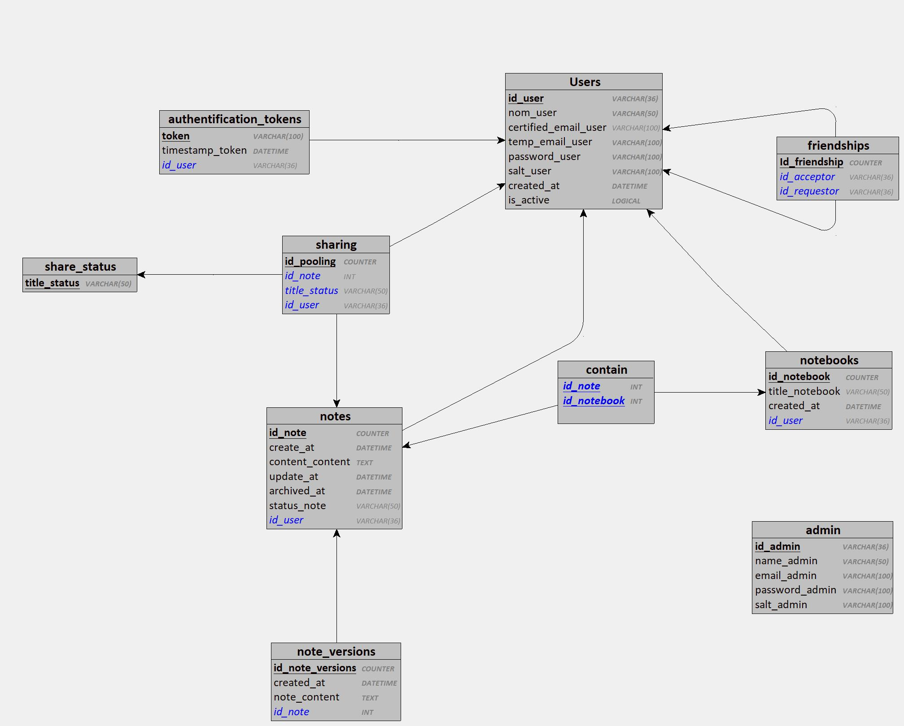

# Modèle Logique de Données (MLD)

## Introduction

Le Modèle Logique de Données (MLD) est une représentation détaillée des structures de données d'un système, décrivant les tables, colonnes, types de données et relations. Il traduit le Modèle Conceptuel des Données en un format adapté à la mise en œuvre dans une base de données, sans inclure de détails physiques.

Pour **Keep This**, le MLD détaille les tables principales telles que Users, Notes, Notebooks, Friends-Users, Status, et NoteSharing. Chaque table inclut des colonnes correspondant aux attributs des entités identifiées dans le MCD, avec des types de données appropriés (UUID, String, DateTime, etc.). Les relations entre les entités, telles que les utilisateurs qui partagent des notes ou les relations d'amitié entre utilisateurs, sont matérialisées par des clés étrangères assurant l'intégrité référentielle.

## Schéma

